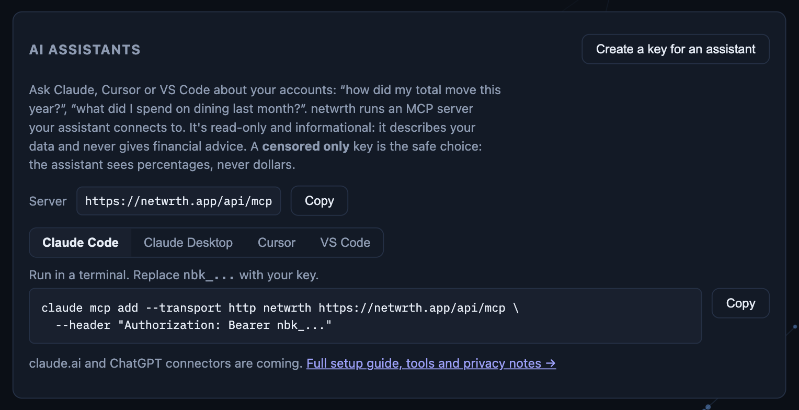

<p align="center">
  <picture>
    <source media="(prefers-color-scheme: dark)" srcset="docs/brand/wordmark-dark.png">
    
  </picture>
</p>

<p align="center">
  Your <a href="https://netwrth.app">netwrth</a> accounts in Claude, Cursor and VS Code —
  a read-only MCP server, censored by default, that describes your money and never gives advice.
</p>

<p align="center"></p>
<p align="center"><sub>Settings → Integrations → AI assistants: create a key and copy the setup for your client, with the key already filled in.</sub></p>

## What you can ask

netwrth runs a remote [Model Context Protocol](https://modelcontextprotocol.io)
server, so any MCP client can read your netwrth dashboard and answer questions
like:

- "How did my total move this year?"
- "How much of what I have is in retirement accounts?"
- "What did I spend on dining in August compared to July?"
- "Which subscriptions renew this month?"
- "Where did my income go last month?"

It is **read-only**: no tool can move money, change accounts or edit
anything. It is **informational only**: the server instructs the model to
describe your data, never to give financial advice.

This repository is the setup guide and the place to
[report problems or ask for tools](https://github.com/eduser25/netwrth-mcp/issues).
The server itself runs inside netwrth; there's nothing to install or host.

| | |
|---|---|
| Endpoint | `https://netwrth.app/api/mcp` |
| Transport | Streamable HTTP (stateless, JSON responses) |
| Auth | a netwrth API key as a bearer token: `Authorization: Bearer nbk_...` |

You need a netwrth account with at least one connected bank.

## 1. Create an API key

Go to [Settings → Integrations](https://netwrth.app/settings/integrations) and,
under **AI assistants**, choose **Create a key for an assistant**. The key is
shown once; the page shows the setup snippets below with it already filled in.
(Any key from the **API keys** list works too.)

The key's scope decides what the model can see. These are the same rules as
the netwrth Home Assistant cards:

| Scope | What the model sees |
|---|---|
| **Censored only** (recommended) | Never dollars. Every amount is a percentage of your current total (the total itself is `100`), so trends, ratios and "what share went to rent" still work. Account names, merchant names and dates are visible. |
| **Full access** | Starts censored too. Real dollar amounts appear only while you have a reveal window open on that key, which you open with your censor PIN (see [Seeing real amounts](#seeing-real-amounts)). |

Every tool result says `"censored": true|false` and
`"units": "USD" | "percent_of_total"`, so the model always knows which one
it's reading.

Treat the key like a password: anyone with it can read what its scope allows.
Revoke it from the same page at any time.

## 2. Connect your client

Replace `nbk_...` with your key.

### Claude Code

```sh
claude mcp add --transport http netwrth https://netwrth.app/api/mcp \
  --header "Authorization: Bearer nbk_..."
```

### Claude Desktop

Claude Desktop talks to local servers, so bridge to the remote one with
[`mcp-remote`](https://www.npmjs.com/package/mcp-remote) (needs Node.js). Edit
`claude_desktop_config.json` (Settings → Developer → Edit Config) and restart
Claude Desktop:

```json
{
  "mcpServers": {
    "netwrth": {
      "command": "npx",
      "args": [
        "-y", "mcp-remote", "https://netwrth.app/api/mcp",
        "--header", "Authorization:${NETWRTH_AUTH}"
      ],
      "env": { "NETWRTH_AUTH": "Bearer nbk_..." }
    }
  }
}
```

(The header goes through an env var because some platforms mangle spaces
inside `args`.)

### Cursor

`~/.cursor/mcp.json`, or `.cursor/mcp.json` in a project (keep that one out of
git):

```json
{
  "mcpServers": {
    "netwrth": {
      "url": "https://netwrth.app/api/mcp",
      "headers": { "Authorization": "Bearer nbk_..." }
    }
  }
}
```

### VS Code (GitHub Copilot agent mode)

`.vscode/mcp.json` in a workspace, or **MCP: Open User Configuration** for all
workspaces. VS Code asks for the key once and stores it securely:

```json
{
  "inputs": [
    { "type": "promptString", "id": "netwrth-key", "description": "netwrth API key", "password": true }
  ],
  "servers": {
    "netwrth": {
      "type": "http",
      "url": "https://netwrth.app/api/mcp",
      "headers": { "Authorization": "Bearer ${input:netwrth-key}" }
    }
  }
}
```

### Other clients

Any client that supports Streamable HTTP with a custom header works: point it
at `https://netwrth.app/api/mcp` and send `Authorization: Bearer nbk_...`.

### claude.ai and ChatGPT

Custom connectors on claude.ai and in ChatGPT sign in with OAuth rather than a
pasted key. OAuth support is planned; until then, use one of the clients
above.

## Seeing real amounts

A **full access** key stays censored until you open a reveal window with your
censor PIN. Never type your PIN into a chat: the model doesn't need it and
shouldn't have it. Open the window yourself instead:

```sh
# reveal for 24 hours (omit ttl_seconds to reveal until you conceal)
curl -X POST https://netwrth.app/api/keys/reveal \
  -H "Authorization: Bearer nbk_..." -H "Content-Type: application/json" \
  -d '{"code": "YOUR_PIN", "ttl_seconds": 86400}'

# hide the amounts again
curl -X POST https://netwrth.app/api/keys/conceal \
  -H "Authorization: Bearer nbk_..."
```

A reveal/conceal button in Settings → Integrations is on the way.

## Tools

| Tool | Arguments | Returns |
|---|---|---|
| `get_net_worth` | — | Your current total (assets minus debts, hidden accounts excluded) and how it changed over 30 days and 1 year |
| `get_net_worth_history` | `range`: `1m` `3m` `6m` `1y` (default) `all` | Your total over time, up to 60 points |
| `list_accounts` | — | Each account's name, kind, retirement/taxable category, institution, balance and last update |
| `get_allocation` | — | The split between retirement, non-retirement and debt, plus retirement, taxable investments, cash, other assets and debt as shares of gross assets |
| `get_spending_summary` | `month` (YYYY-MM) | Spending per theme, total spend, total income |
| `search_transactions` | `month` or `from`/`to` (up to 366 days), `theme`, `merchant` (partial match), `min_amount`/`max_amount`, `limit` (up to 200) | Matching transactions, newest first |
| `get_recurring` | `include_inactive` | Bills, subscriptions and income streams with frequency and typical amounts; what's still expected this month |
| `get_cash_flow` | `month` (YYYY-MM) | Income by source, spending by theme, debt payments and what was left over; transfers between your own accounts excluded |

Conventions: balances are negative for debt; transaction amounts are positive
for money out and negative for money in.

The four spending tools need spending analysis turned on in netwrth. Without
it they answer `{"available": false, "message": ...}` instead of data.

## Privacy

- The model only ever sees what the key's scope allows, through the same
  censoring code the netwrth dashboard and Home Assistant cards use.
- No bank credentials, provider tokens or account numbers are exposed by any
  tool.
- Your API key lives in your client's config; netwrth stores only a hash of
  it. Your PIN never passes through the model.
- What the model does with the answers is up to your AI provider's own data
  policy.

## Support

Open an [issue](https://github.com/eduser25/netwrth-mcp/issues) for bugs,
client setups that don't work, or tools you'd like to see.

netwrth is informational only and does not provide financial, tax or
investment advice.
